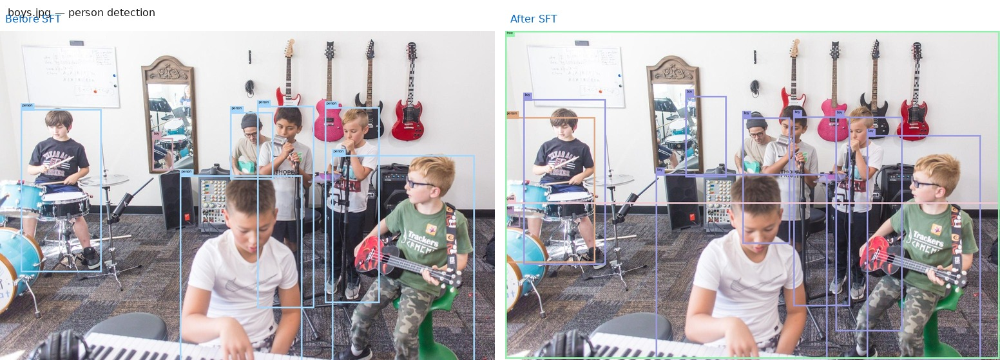
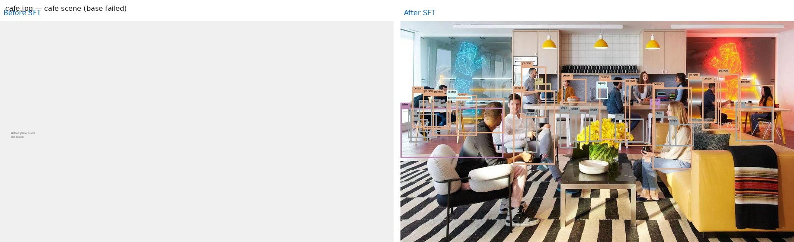

# Qwen2.5-VL Grounding SFT Demo

Visual grounding / open-vocabulary detection with [Qwen2.5-VL-3B-Instruct](https://huggingface.co/Qwen/Qwen2.5-VL-3B-Instruct): inference, visualization, and SFT fine-tuning on toy grounding data.

Based on [Brilliant-B/awesome-demos](https://huggingface.co/datasets/Brilliant-B/awesome-demos).

## Results (SFT completed)

Fine-tuning on 1K Grounding-ToyData samples, evaluated on 5 fixed test images:

| Metric | Base model | After SFT |
|--------|-----------|-----------|
| Parse success | 3/5 | **5/5** |
| Total boxes | 22 | 65 |
| Output format | JSON / XML mixed | Unified grounding tokens |

### Before / After comparisons

**boys.jpg** — person detection



**cafe.jpg** — base model failed to parse (left shows failure placeholder)



**gui.png** · **layout.jpg** · **gndtest1** — see [`SHOWCASE.md`](SHOWCASE.md) or [`records/results/exp-001/`](records/results/exp-001/)

Full report: [`logs/comparison/COMPARISON.md`](logs/comparison/COMPARISON.md)

**Resume / portfolio copy**: [`RESUME.md`](RESUME.md) · Experiment log: [`records/experiments.md`](records/experiments.md)

## Setup

```bash
# 1. Clone this repo
git clone <your-repo-url>
cd demo1

# 2. Download model (~7GB)
pip install huggingface_hub
HF_ENDPOINT=https://hf-mirror.com huggingface-cli download Qwen/Qwen2.5-VL-3B-Instruct \
  --local-dir pretrained/Qwen2.5-VL-3B-Instruct

# 3. Download dataset (images.tsv is not in repo due to GitHub size limit)
#    Get demo1.tar.gz from awesome-demos and extract datasets/Grounding-ToyData/

# 4. Install dependencies
pip install -e .
pip install mmengine liger-kernel ujson
pip install --no-deps -e finetuning
```

## Inference

```bash
cd /path/to/demo1
python inference/grounding_sft_models/detection_inference.py
```

Batch inference on `inference/test_images/`; outputs `{name}_visualize.jpg` next to each input.

## Fine-tuning

```bash
bash finetuning/scripts/sft_gnd.sh
```

Checkpoints saved under `work_dirs/grounding-sft-0/`.

## Project layout

```
demo1/
├── finetuning/          # SFT training code & configs
├── inference/           # Inference scripts & test images
├── visualizer/          # Wrapper, parser, visualization
├── datasets/            # Grounding-ToyData (download images.tsv separately)
├── testfiles/           # Custom test images
└── pretrained/          # Model weights (download separately)
```
