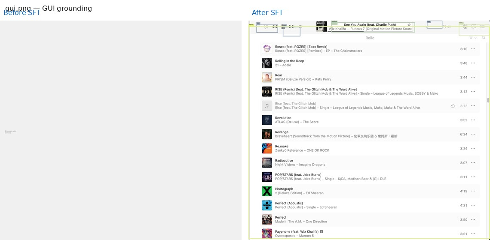
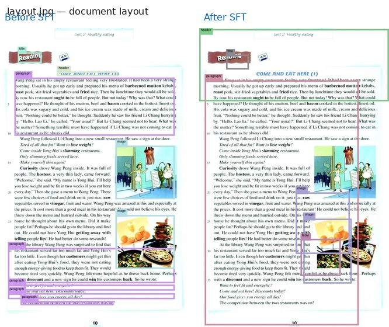
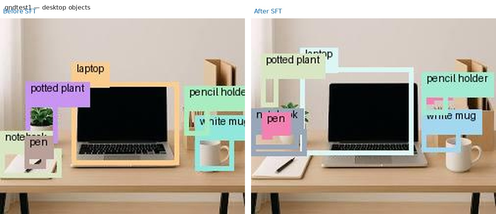

# Grounding SFT — 对比可视化

微调前（基座 Qwen2.5-VL-3B）vs 微调后（SFT），5 张固定测试图。

## boys.jpg — 人物检测

## cafe.jpg — 咖啡馆（基座解析失败）

## gui.png — GUI 元素

## layout.jpg — 文档版面

## gndtest1 — 桌面物品

---

数据与复现：[`logs/comparison/COMPARISON.md`](logs/comparison/COMPARISON.md)
